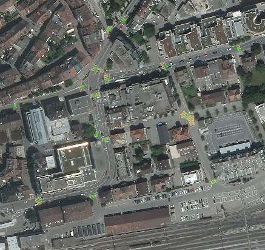
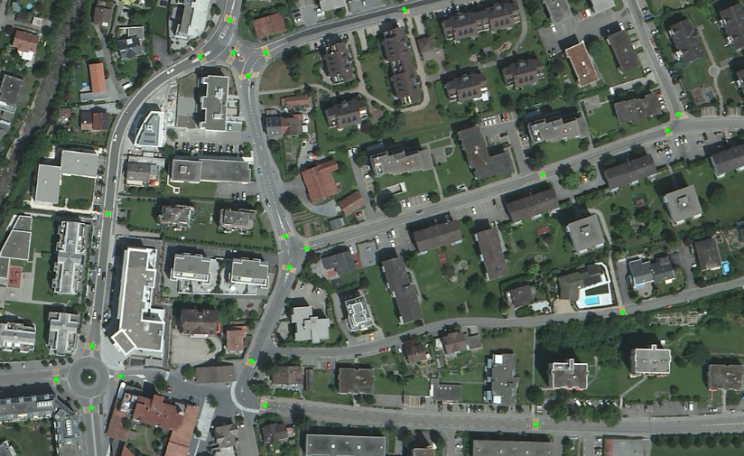

# OSM-Crosswalk-Detection: Deep learning based image recognition

## You just have found this project

OSM-Crosswalk-Detection is a high scalable image recognition software for aerial photos (orthophotos). It uses the deep learning library Keras, more precisely a VGGNet like convolutional neural network, to detect crosswalks along streets.
This python based project provides a keras docker container to train the neural network on a gpu and  several docker container to distribute the recognition work on multiple servers.

This work is part of the semester thesis at the university of applied science Rapperswil (HSR).

## Overview

## Examples

Rapperswil trainstation (47.226468, 8.818477)

Rapperswil suburb (47.232803, 8.837321)

## Further informations
http://wiki.hsr.ch/StefanKeller/SA_BA_Gamified_Extraction_of_Crosswalks_from_Aerial_Images

## Links
- www.hsr.ch
- www.osm.org
- www.maproulette.org

